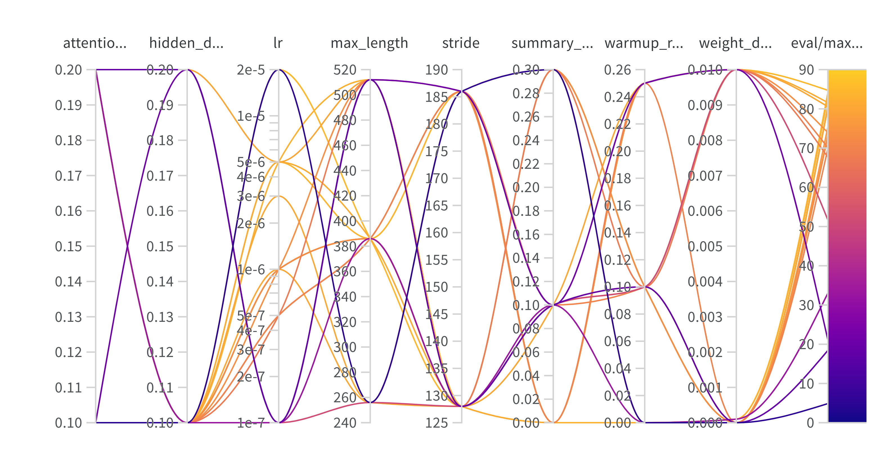
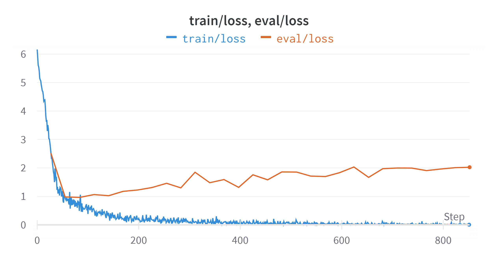
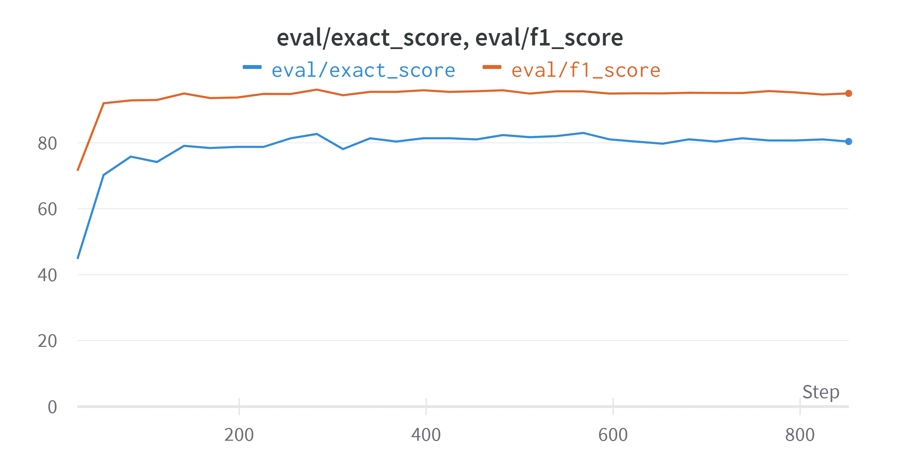
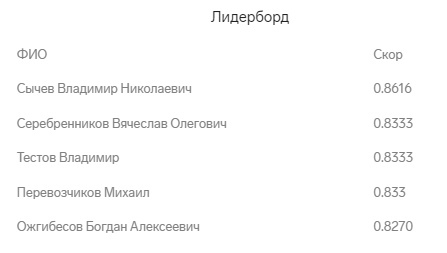

# Question answering in legal contracts (RU) 💬
Assignment completed as part of the selection process for the DS internship at Kontur
## Stack of technologies 🏗
- Python 🐍
- Transformers 🤗
- Wandb 📊
## Task description 📋
The task is to find a piece of text in the contract that corresponds to one of the queries: "обеспечение гарантийных обязательств" or "обеспечение исполнения контракта". 

A detailed description of the task can be found in [task_description.md](https://github.com/miglss/QA-document-parts/blob/main/task_description.md)
## Proposed solution 💡
For this task mdeberta-v3-base-squad2 model from 🤗 was fine-tuned. Custom tokenizer was also trained on a new corpus.

Hyperparameters optimization was performed using Wandb sweep's: 

After that, model was trained for 30 epochs using best set of hyperparameters

Although a smaller number of epochs could have been avoided, as can be seen from the losses graph:

Quality on validation set during training:

Final quality on test:
- exact score: 84.44444444444444
- f1-score: 97.47689267517949

## Leaderboard
Final position in leaderboard - TOP 5:

## How to improve 🔨
1. I checked only mdeberta-v3-base-squad2 model, but other models can show a better results 
2. Expanding the sample in some artificial way can improve the final quality of the model 
